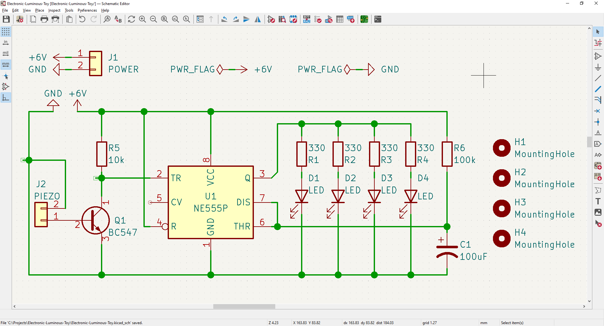
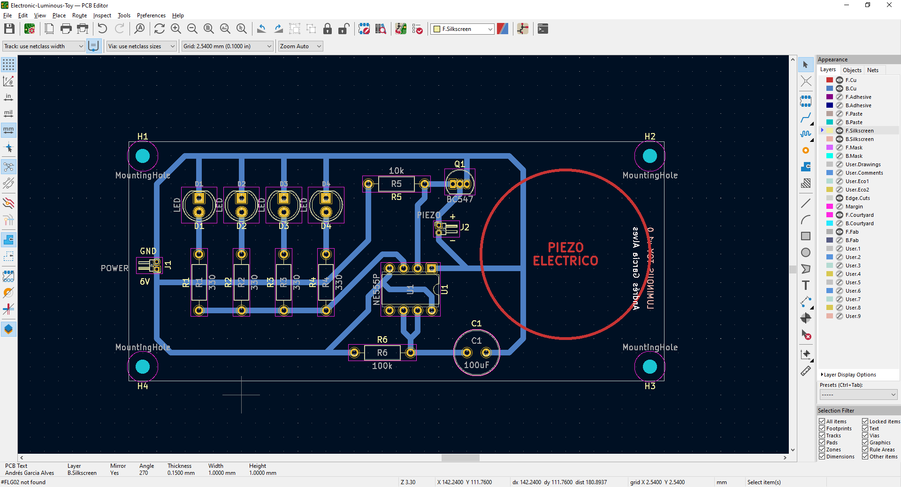
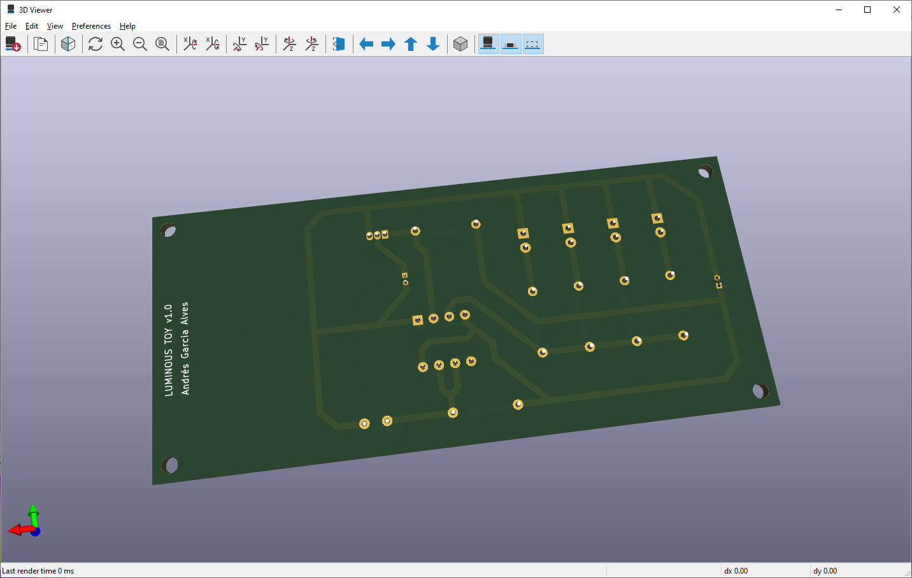
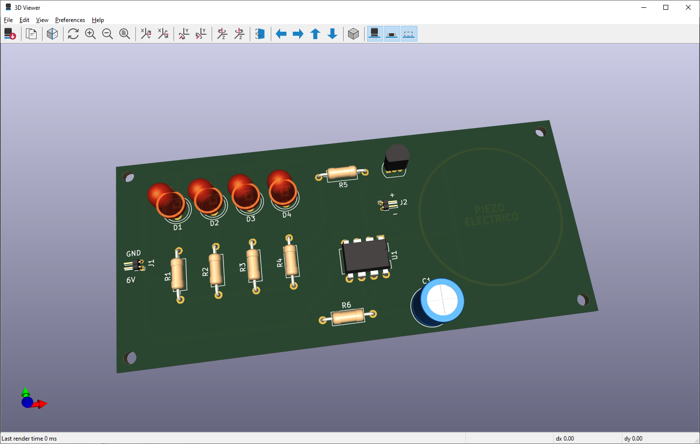
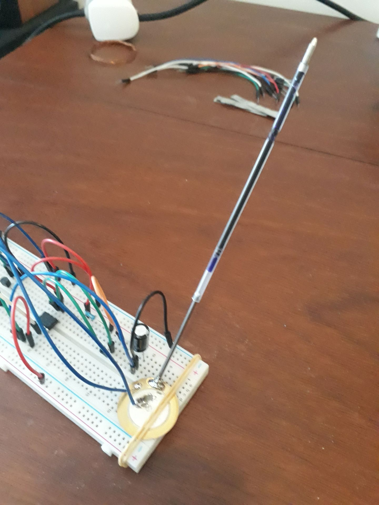
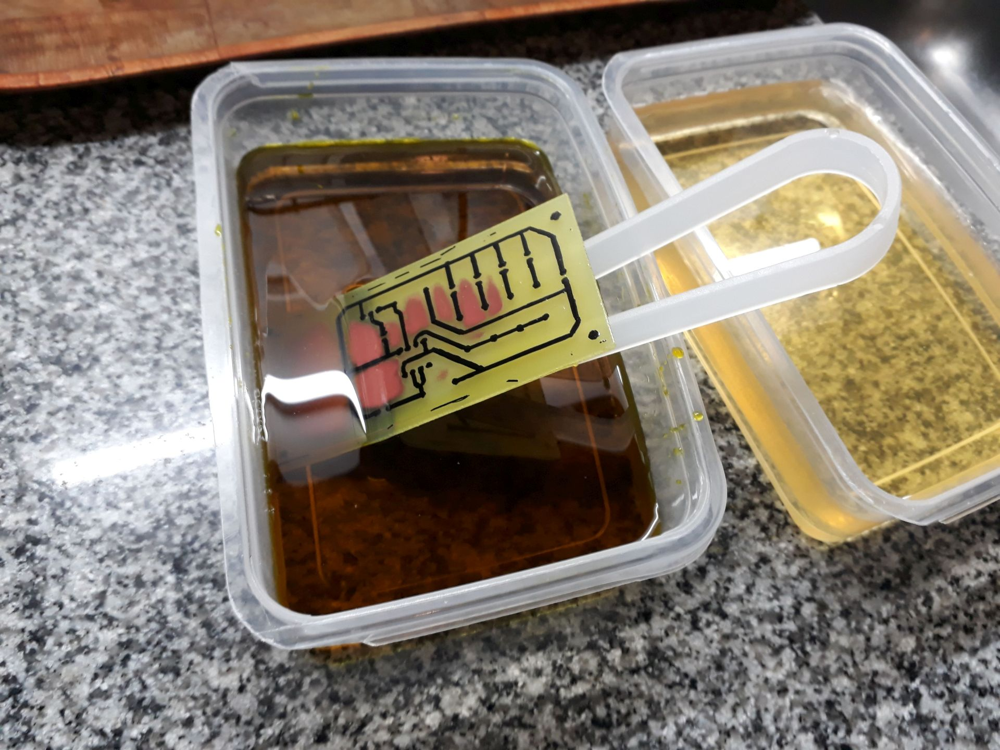
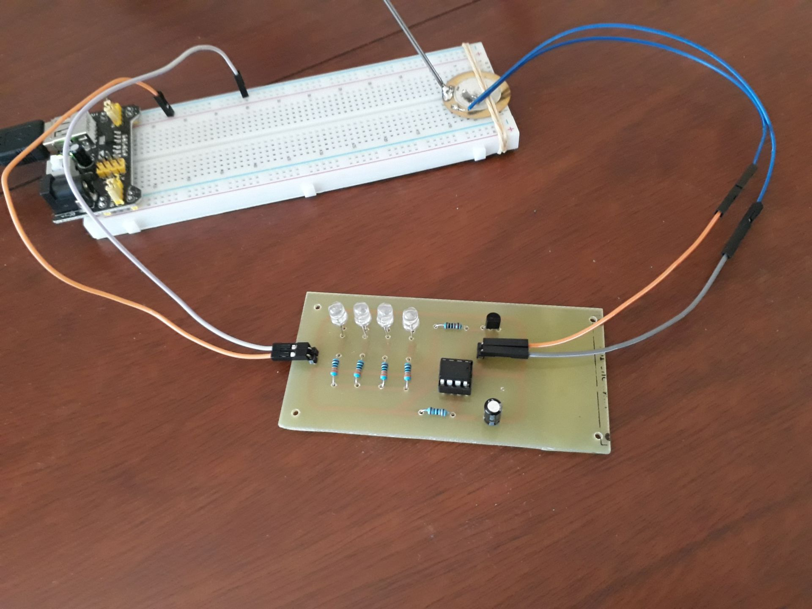
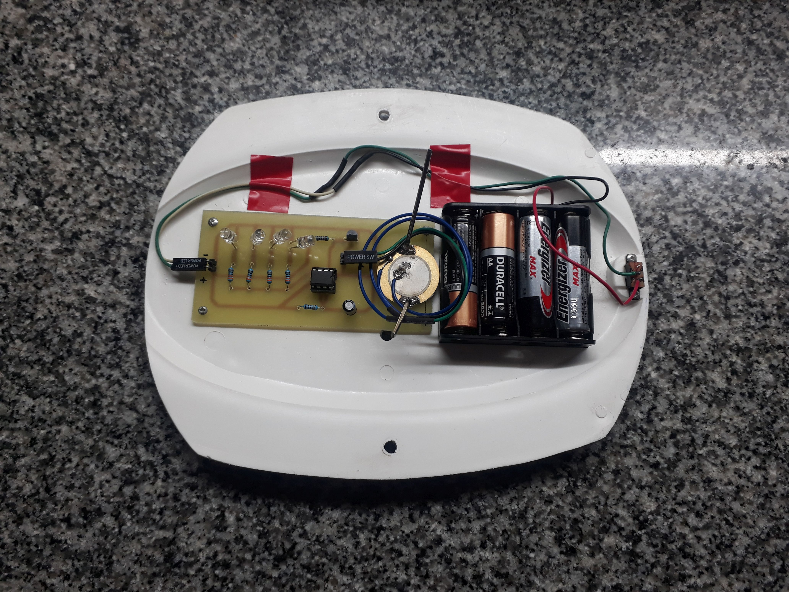
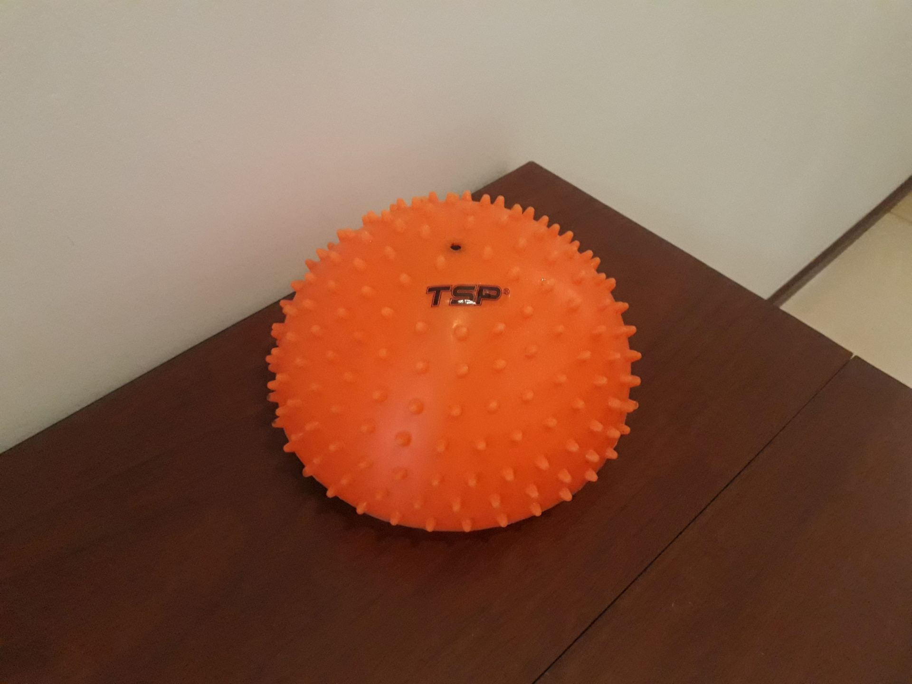
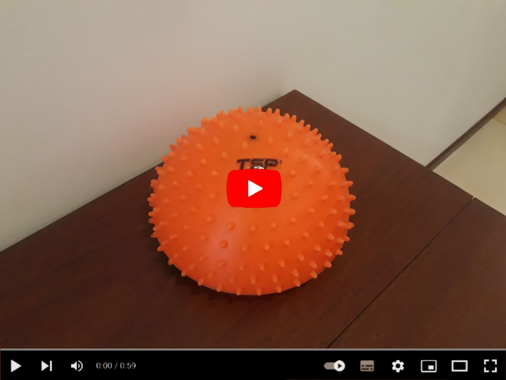

# Luminous Touch Toy v1.0

Luminous Touch Toy made with NE555 & a piezo-electric sensor, with auto-off functionality.

&nbsp;

This project use the following electronic components:
- 1 x Integrated circuit NE555
- 1 x Piezo-electric sensor
- 4 x Multi-color LEDs
- 4 x 330 ohm resistors
- 1 x 10k ohm resistors
- 1 x 100k ohm resistor
- 1 x Transistor BC547 NPN
- 1 x Electrolitic capacitor 100uF 10v
- 1 x Switch-button
- 4 x Bateries 1.5v
- Some Empty Pen Tubes

The circuit:
- When pressing the toy surface it moves the empty pen tubes, making some presure on the piezo-electric.
- The piezo-electric generates some low voltages on presure, activating the electronic circuit.
- The NE555 IC handles the 12 seconds enabled delay.

Notes:
- KiCad 6.0 schematic & PCB blueprints are also included.

&nbsp;

### Screenshots

| Diagram - Schematics 01                         | Diagram - Schematics 02                         |
|-------------------------------------------------|-------------------------------------------------|
|          |                |

| Diagram - PCB Render                            | Diagram - PCB Render                            |
|-------------------------------------------------|-------------------------------------------------|
|      |       |

| Prototype                                       | PCB Manufacturing                               |
|-------------------------------------------------|-------------------------------------------------|
|               |       |

| PCB Assembly                                    | Toy Assembly                                    |
|-------------------------------------------------|-------------------------------------------------|
|            |             |

| Project Final                                   | Project Final (YouTube video)                   |
|-------------------------------------------------|-------------------------------------------------|
|           |  |

See 'Rescources' sub-folder for more pictures of the proyect.

&nbsp;

### Version History

v1.0 (2023.04.17) - Initial release.  

&nbsp;

This source code is licensed under GPL v3.0  
Please send me your feedback about this app: andres.garcia.alves@gmail.com
